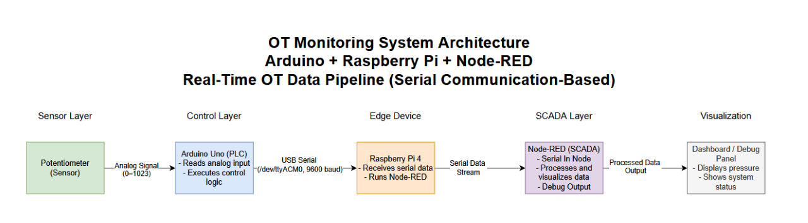
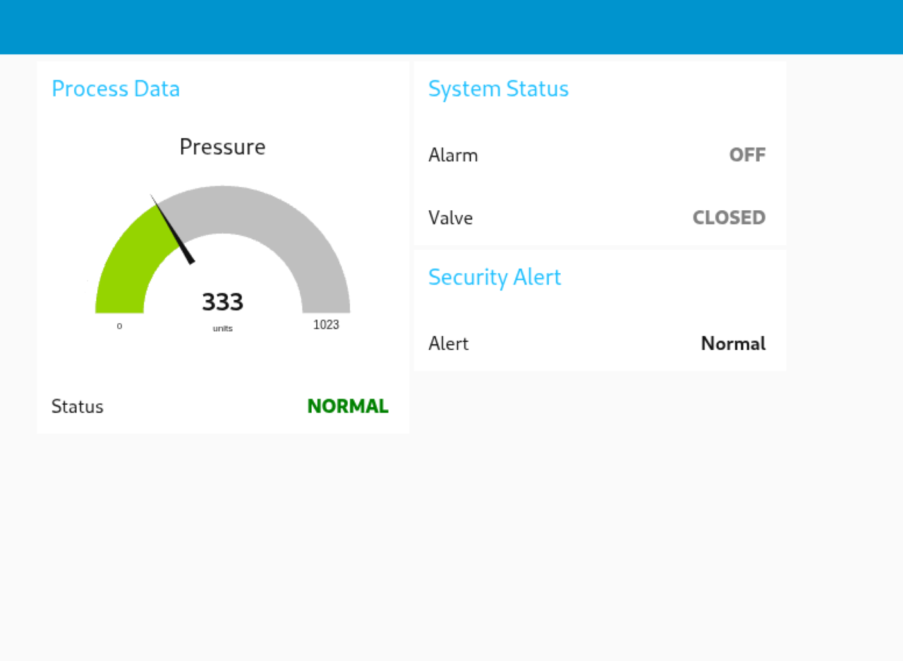
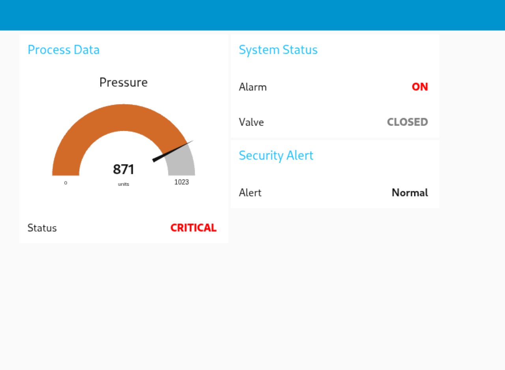
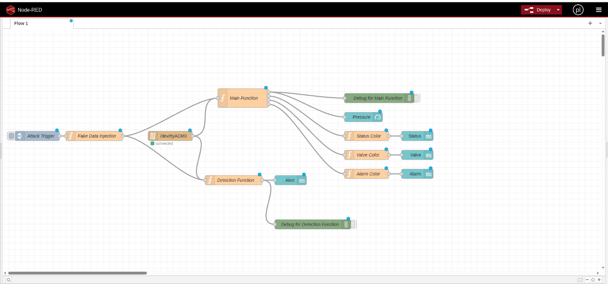
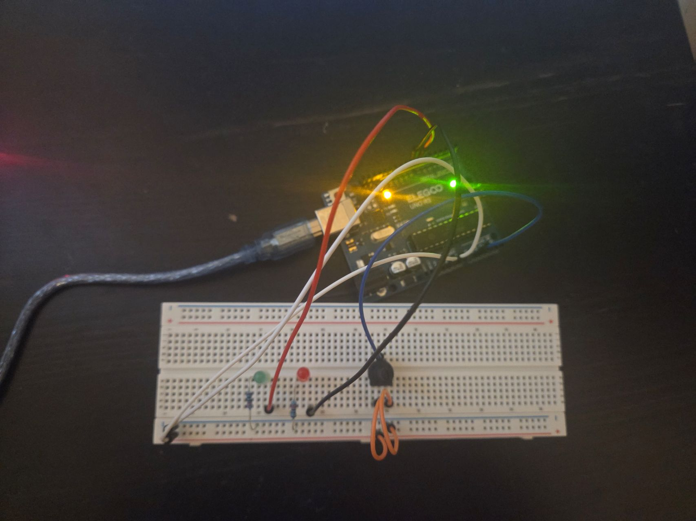
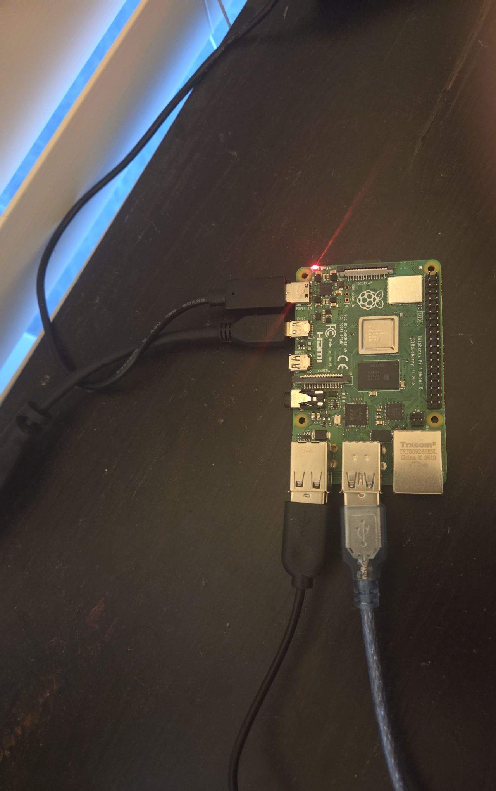
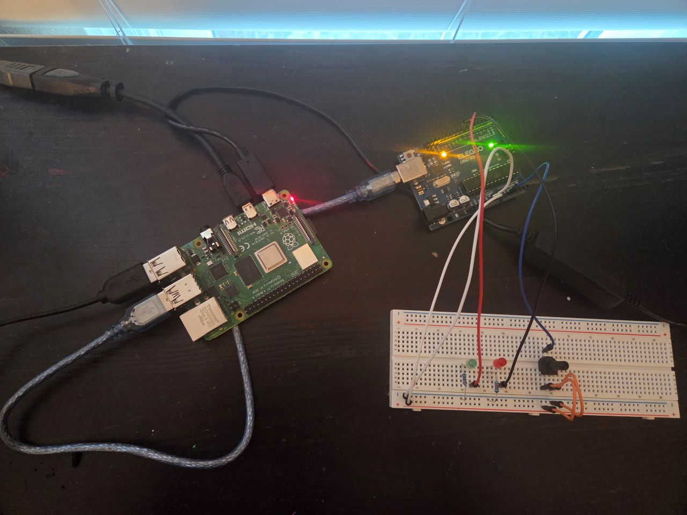
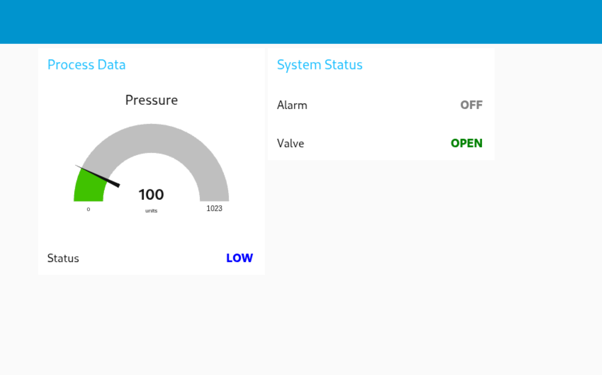
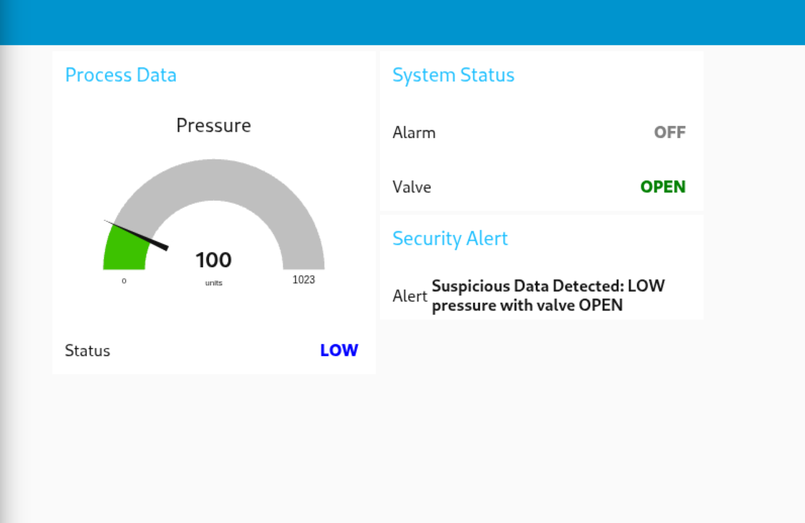

# OT Cybersecurity Lab: Gas Pipeline Monitoring System 

## Overview

This project simulates a basic Operational Technology (OT) system used in industrial environments such as gas pipelines.

I built a complete monitoring system using an Arduino as a PLC, a Raspberry Pi as the control system, and Node-RED as a SCADA interface. I then expanded the project to include cybersecurity concepts such as network analysis, attack simulation, and detection.

This project helped me understand not just how OT systems operate, but also how they can be analyzed, attacked, and secured.

---

## System Architecture



---

## Technologies Used

- Arduino (PLC simulation)
- Raspberry Pi (Linux environment)
- Node-RED (SCADA dashboard)
- Kali Linux (network reconnaissance)
- Wireshark (traffic analysis)
- Nmap (network scanning)

---

## System Workflow

```
Sensor (Potentiometer) → Arduino → Serial Communication → Raspberry Pi → Node-RED → Dashboard
```

---

## Dashboard Features

- Real-time pressure monitoring (gauge)
- Color-coded system status:
  - LOW (blue)
  - NORMAL (green)
  - HIGH (orange)
  - CRITICAL (red)
- Valve state (OPEN / CLOSED)
- Alarm state (ON / OFF)
- Security alert system for suspicious data

---

## Dashboard Examples

### Normal Operation


### Critical Condition


### Additional System States

See full range of system behavior in the /images folder:
- LOW
- NORMAL
- HIGH
- CRITICAL
---
## Node-RED Flow

This flow represents the core SCADA logic of the system. It includes:

- Serial data ingestion from Arduino  
- Data parsing and processing  
- Dashboard visualization  
- Simulated attack injection  
- Detection of anomalous system states  



---
## 🔌 Hardware Setup

### Arduino + Sensors


### Raspberry Pi Controller


### Full System Setup


For wiring reference, see the schematic in the /images folder.

---

## Cybersecurity Implementation

### 1. Network Traffic Analysis (Wireshark)

Captured and analyzed network traffic from the Raspberry Pi while interacting with the system. Learned to differentiate between normal background traffic and system-generated activity.

---

### 2. Network Reconnaissance (Kali Linux + Nmap)

Used Kali Linux to scan the network and identify active devices and open ports.

Discovered:
- Port 22 (SSH)
- Port 1880 (Node-RED SCADA interface)

---

### 3. Attack Simulation (Data Injection)

Simulated a false data injection attack by introducing unauthorized input into the SCADA pipeline.

Example injected message:
```
Pressure: 100 | Status: LOW | Valve: OPEN | Alarm: OFF
```



---

### 4. Detection System

Implemented detection logic to identify inconsistent system states.

Examples:
- LOW pressure with valve OPEN
- CRITICAL pressure with alarm OFF
- HIGH pressure with valve CLOSED

System triggers:
```
Suspicious Data Detected
```



---

## Challenges & Solutions

- **Wireshark interface not visible**
  - Fixed by adding user to Wireshark group and rebooting

- **No visible Node-RED traffic**
  - Learned difference between local vs network traffic and accessed system via IP

- **Kali Linux could not detect Raspberry Pi**
  - Fixed by switching VM to bridged adapter

- **Detection not triggering initially**
  - Real-time data was overwriting injected data, resolved by isolating test flow

- **Node-RED wiring issues**
  - Corrected multiple outputs and connections

---

## Code & Implementation

- Arduino Controller  
  [arduino_controller.ino](code/arduino_controller.ino)

- Node-RED Functions  
  [node_red_functions.js](code/node_red_functions.js)

- Full Node-RED Flow  
  [node_red_flow.json](code/node_red_flow.json)

---

## Key Takeaways

- OT systems rely heavily on trusted data
- Lack of validation creates serious security risks
- Monitoring alone is not enough — detection is critical
- Real-world systems require both engineering and security thinking

---


## Future Improvements

- Implement encrypted communication
- Expand detection rules
- Simulate additional attack scenarios

---

## Final Thoughts

This project challenged me to think beyond just building a system and focus on how it could be attacked and secured. It gave me hands-on experience with OT concepts, networking, and real-world cybersecurity scenarios.

